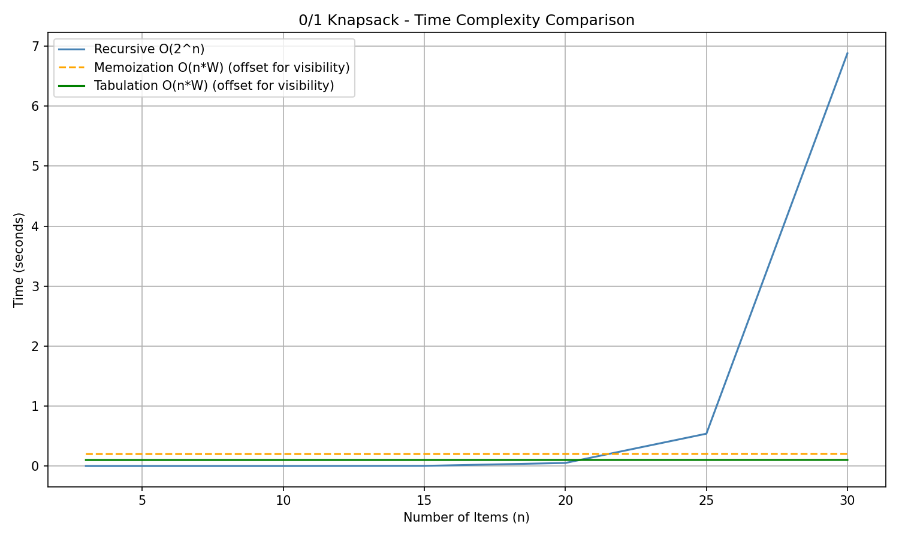
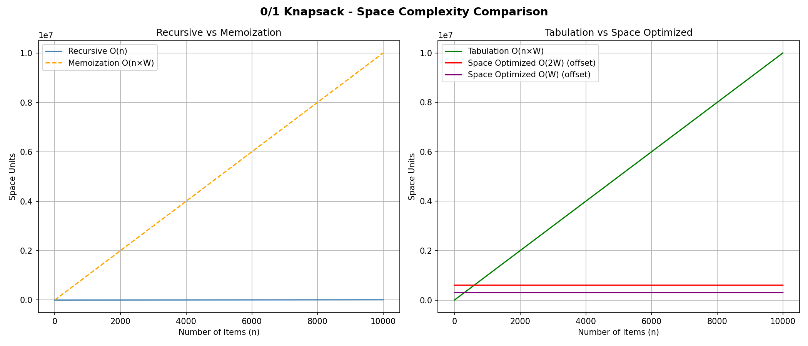

# 0/1 Knapsack Problem

Given two arrays `val[]` and `wt[]`, where each element represents the value and weight of an item, and an integer `W` representing the maximum knapsack capacity — find the maximum value achievable without exceeding `W`. Each item can either be included completely or excluded; fractional selection is not allowed.

---

## Approaches

| Approach | Time Complexity | Space Complexity |
|---|---|---|
| Recursive | O(2^n) | O(n) stack |
| Memoization | O(n × W) | O(n × W) + O(n) stack |
| Tabulation (2D array) | O(n × W) | O(n × W) |
| Tabulation (2 arrays) | O(n × W) | O(2W) |
| Tabulation (1 array) ⭐ | O(n × W) | O(W) |

---

## Key Insight: 1D Space Optimization

The most significant optimization in this problem is reducing space from **O(n × W)** to **O(W)** using a single array.

Instead of maintaining a full 2D dp table across all items, we observe that each row only depends on the previous row. This means we can update a single array **in-place**, iterating from right to left to avoid overwriting values we still need:

```python
for i in range(1, n):
    for w in range(W, -1, -1):  # reverse traversal is the key
        if wt[i] <= w:
            prev[w] = max(val[i] + prev[w - wt[i]], prev[w])
```

Same time complexity. Same correct answer. A fraction of the memory.

---

## Benchmarks

### Time Complexity



Recursive with no memoization grows at **O(2^n)** — it stays fast for small inputs but explodes exponentially past n=20. Memoization and Tabulation both run in **O(n × W)** and stay flat even as n grows. Note: Memoization and Tabulation lines are offset slightly for visibility since their actual times are near zero relative to Recursive.

### Space Complexity



The left chart shows the cost of adding a dp table — Memoization jumps from O(n) stack space to O(n × W). The right chart shows the optimization journey: Tabulation at O(n × W) can be reduced to O(2W) using two arrays, and further to **O(W) using a single array** — the same time complexity, but memory usage that stays constant regardless of how many items there are.

---

## Run

```bash
python3 0_1Knapsack.py
```

Outputs `time_comparison.png` and `space_comparison.png` in the same directory.