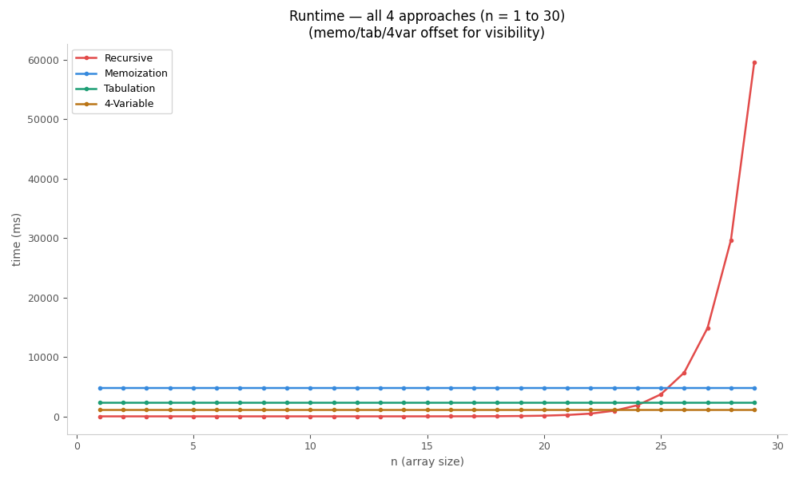
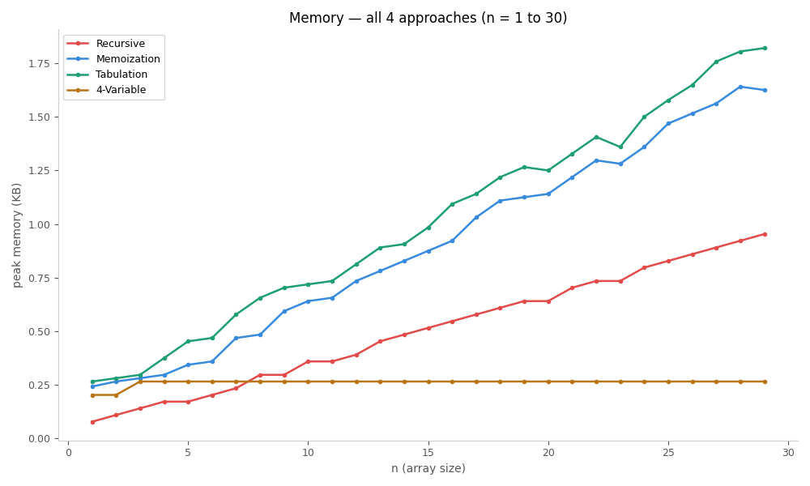

# Best Time to Buy and Sell Stock II — Algorithm Evolution

Empirical runtime and memory benchmarks across four algorithmic approaches to the classic stock trading problem, showing the progression from exponential recursion to O(1) space optimization.

## Problem

Given an array `prices` where `prices[i]` is the price of a stock on day `i`, return the maximum profit achievable by buying and selling on any days, with the constraint that you must sell before buying again.

## Approaches

| Approach | Time Complexity | Space Complexity |
|---|---|---|
| Recursive | O(2^n) | O(n) — call stack |
| Memoization | O(2n) | O(2n) — dp array + call stack |
| Tabulation | O(2n) | O(2n) — dp array |
| 4-Variable | O(n) | O(1) |


### 4-Variable
Observes that tabulation only ever looks at the next row — so the entire 2D table collapses to 4 variables: `aheadBuy`, `aheadNotBuy`, `curBuy`, `curNotBuy`. O(1) space, same time complexity as tabulation.

## Results

### Runtime (n = 1 to 30)


Recursive explodes exponentially past n=22 while memo, tabulation, and 4-variable stay flat near zero. Memo and tabulation are offset slightly for visibility.

### Memory (n = 1 to 30)


4-variable stays completely flat — O(1) space confirmed empirically. Tabulation allocates the full dp array upfront, making it the most memory-intensive at all sizes. Memoization sits between tabulation and recursion due to dictionary overhead on top of the call stack. Recursive memory grows with call stack depth but remains cheaper than dp approaches at small n due to Python's object overhead per list element.

## Key Observations

- **Recursion vs Memoization** — identical logic, dramatically different runtime. The only difference is caching — memoization never recomputes a `(index, buy_state)` pair twice.
- **Memoization vs Tabulation** — same time and space complexity asymptotically, but tabulation is faster in practice due to no function call overhead and better cache locality.
- **Tabulation vs 4-Variable** — same time complexity, but 4-variable eliminates the dp array entirely by observing that only the adjacent row is ever needed.
- **Memory crossover** — at small n, recursive uses less memory than dp approaches because Python list/dict object overhead dominates over stack frame size. This crossover reverses at larger n.

## Running the Benchmark

```bash
pip install matplotlib
python buy_sell_stocks.py
```

Generates `runtime_n30.png` and `memory_n30.png` in the same directory.

## Related

- [0/1 Knapsack Benchmark](../0_1Knapsack/)